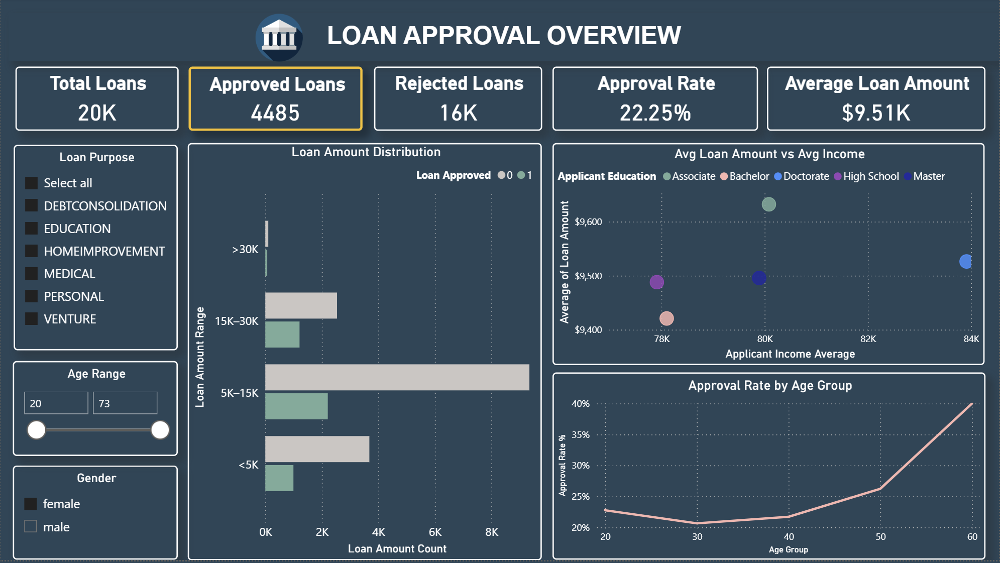
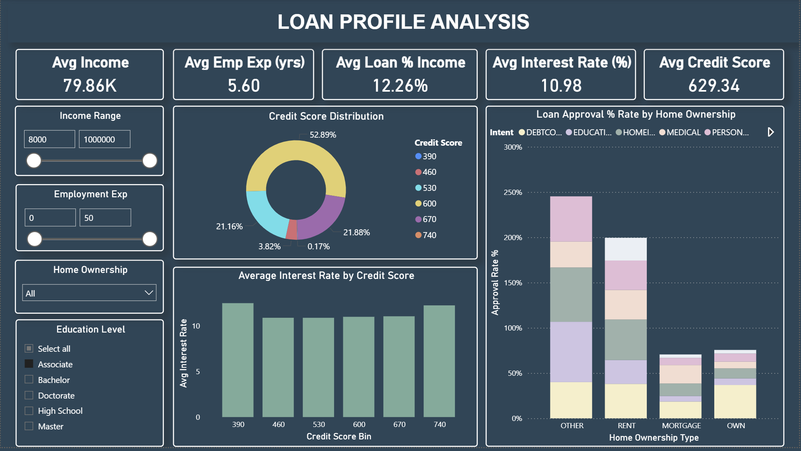

# Loan_Approval_Prediction

## Project Overview
This is a machine learning project to predict the likelihood of loan approval based on customer and loan-related data. The project covers the full data science workflow, from data cleaning and preprocessing to exploratory analysis, model training, and evaluation.

A Streamlit app allows users to interactively input data and get loan approval predictions, while a dashboard provides a summary of insights and key metrics.

---

## Features
- **Data Cleaning:** Handling missing values, duplicates, and encoding categorical features.
- **Exploratory Data Analysis (EDA):** Visualizations and correlation analysis to understand feature relationships.
- **Feature Engineering & Scaling:** Preparing numeric and categorical features for machine learning models.
- **Model Training:** Using multiple algorithms like Logistic Regression, Random Forest, XGBoost.
- **Evaluation:** Metrics including accuracy, confusion matrix, classification report, and probability thresholds.
- **Interactive App:** Streamlit-based app for live predictions.
- **Dashboard:** Summarizes insights.

---

## Development Environment
- **Tools:** Jupyter Notebook, VS Code  
- **Packages:** pandas, numpy, scikit-learn, xgboost, matplotlib, seaborn, streamlit  

---

## Running the Streamlit App 
```bash
streamlit run app.py
```

- Enter customer and loan details in the input form.
- Get predicted loan approval probability instantly.

---

## Key Learnings

- Handling imbalanced datasets and tuning probability thresholds
- Feature importance analysis using coefficients and tree-based models
- Deploying ML models through interactive apps
- End-to-end project workflow from raw data to actionable predictions

---

## Power BI Dashboard

### Page 1: Loan Approval Overview


**Insights Covered:**
- Total, Approved, and Rejected Loans
- Approval Rate and Average Loan Amount
- Loan trends by age, purpose, and income

---

### Page 2: Loan Profile Analysis


**Insights Covered:**
- Credit score distribution
- Approval rate by home ownership
- Interest rate trends across credit score ranges
